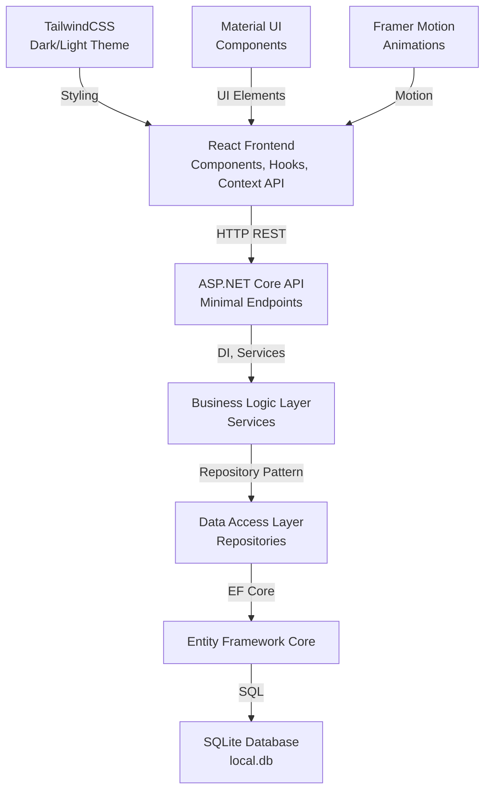

# Design Document: Aplicação de Gestão Financeira Pessoal

## Overview

Sistema completo de gestão financeira pessoal desenvolvido com ASP.NET Core Minimal API no backend e React com Material UI/TailwindCSS no frontend. A aplicação permite cadastro, edição, exclusão e listagem de transações (receitas e despesas), cálculo automático de saldos, geração de relatórios e visualização de dados através de gráficos interativos. Utiliza SQLite como banco de dados local em arquivo único, eliminando necessidade de migrations e oferecendo portabilidade máxima.

A arquitetura segue padrões profissionais SOLID com separação em camadas (Controllers/Endpoints → Services → Repositories → Entity Framework Core → SQLite), implementa injeção de dependência, tratamento global de erros, e componentes React reutilizáveis com Context API para gerenciamento de estado.

## Architecture

Arquitetura em camadas com separação clara de responsabilidades:



## Backend Structure

### Estrutura de Pastas - ASP.NET Core

```
minimalApi/
├── Program.cs                          # Configuração principal, DI setup, endpoints
├── appsettings.json                    # Configurações gerais
├── appsettings.Development.json        # Configurações de desenvolvimento
│
├── Dominio/                            # Domain Models
│   ├── Entidades/
│   │   ├── Transaction.cs
│   │   ├── Category.cs
│   │   ├── User.cs
│   │   ├── Goal.cs
│   │   └── TransactionLimit.cs
│   │
│   └── DTOS/
│       ├── Requests/
│       │   ├── CreateTransactionRequest.cs
│       │   ├── UpdateTransactionRequest.cs
│       │   ├── CreateCategoryRequest.cs
│       │   ├── CreateGoalRequest.cs
│       │   └── CreateLimitRequest.cs
│       │
│       └── Responses/
│           ├── TransactionResponse.cs
│           ├── CategoryResponse.cs
│           ├── DashboardResponse.cs
│           ├── ReportResponse.cs
│           └── ErrorResponse.cs
│
├── Aplicacao/                          # Application Layer
│   ├── Servicos/
│   │   ├── ITransactionService.cs
│   │   ├── TransactionService.cs
│   │   ├── ICategoryService.cs
│   │   ├── CategoryService.cs
│   │   ├── IReportService.cs
│   │   ├── ReportService.cs
│   │   ├── IExportService.cs
│   │   ├── ExportService.cs
│   │   └── IDashboardService.cs
│   │   └── DashboardService.cs
│   │
│   └── Middleware/
│       ├── GlobalExceptionHandler.cs
│       └── ValidationMiddleware.cs
│
├── Infraestrutura/                     # Infrastructure Layer
│   ├── Db/
│   │   ├── DbContexto.cs              # EF Core Context
│   │   └── SeedData.cs                # Dados iniciais
│   │
│   └── Repositorios/
│       ├── IRepository.cs             # Interface genérica
│       ├── Repository.cs              # Implementação genérica
│       ├── ITransactionRepository.cs
│       ├── TransactionRepository.cs
│       ├── ICategoryRepository.cs
│       └── CategoryRepository.cs
│
└── local.db                            # Banco de dados SQLite
```

## Database Schema

### Tabelas SQLite

```sql
-- Usuários
CREATE TABLE Users (
    Id UUID PRIMARY KEY,
    Username NVARCHAR(100) NOT NULL UNIQUE,
    Email NVARCHAR(100) UNIQUE,
    CreatedAt DATETIME DEFAULT CURRENT_TIMESTAMP,
    UpdatedAt DATETIME DEFAULT CURRENT_TIMESTAMP
);

-- Categorias (receitas/despesas)
CREATE TABLE Categories (
    Id UUID PRIMARY KEY,
    UserId UUID NOT NULL FOREIGN KEY,
    Name NVARCHAR(50) NOT NULL,
    Icon NVARCHAR(30),
    Color NVARCHAR(7),
    Type NVARCHAR(20),      -- 'Income' ou 'Expense'
    CreatedAt DATETIME DEFAULT CURRENT_TIMESTAMP,
    UpdatedAt DATETIME DEFAULT CURRENT_TIMESTAMP,
    UNIQUE (UserId, Name, Type),
    FOREIGN KEY (UserId) REFERENCES Users(Id) ON DELETE CASCADE
);

-- Transações
CREATE TABLE Transactions (
    Id UUID PRIMARY KEY,
    UserId UUID NOT NULL,
    CategoryId UUID NOT NULL,
    Amount DECIMAL(18,2) NOT NULL,
    Description NVARCHAR(255),
    Type NVARCHAR(20),      -- 'Income' ou 'Expense'
    Date DATE NOT NULL,
    CreatedAt DATETIME DEFAULT CURRENT_TIMESTAMP,
    UpdatedAt DATETIME DEFAULT CURRENT_TIMESTAMP,
    FOREIGN KEY (UserId) REFERENCES Users(Id) ON DELETE CASCADE,
    FOREIGN KEY (CategoryId) REFERENCES Categories(Id) ON DELETE CASCADE,
    INDEX idx_user_date (UserId, Date),
    INDEX idx_category_date (CategoryId, Date)
);

-- Metas Financeiras
CREATE TABLE Goals (
    Id UUID PRIMARY KEY,
    UserId UUID NOT NULL,
    Name NVARCHAR(100) NOT NULL,
    TargetAmount DECIMAL(18,2) NOT NULL,
    CurrentAmount DECIMAL(18,2) DEFAULT 0,
    Deadline DATE,
    Status NVARCHAR(20),    -- 'Active', 'Completed', 'Cancelled'
    CreatedAt DATETIME DEFAULT CURRENT_TIMESTAMP,
    UpdatedAt DATETIME DEFAULT CURRENT_TIMESTAMP,
    FOREIGN KEY (UserId) REFERENCES Users(Id) ON DELETE CASCADE
);

-- Limites de Gastos
CREATE TABLE TransactionLimits (
    Id UUID PRIMARY KEY,
    UserId UUID NOT NULL,
    CategoryId UUID,
    LimitAmount DECIMAL(18,2) NOT NULL,
    Period NVARCHAR(20),    -- 'Monthly', 'Weekly', 'Daily'
    AlertThreshold DECIMAL(5,2) DEFAULT 80,  -- Percentual
    CreatedAt DATETIME DEFAULT CURRENT_TIMESTAMP,
    UpdatedAt DATETIME DEFAULT CURRENT_TIMESTAMP,
    FOREIGN KEY (UserId) REFERENCES Users(Id) ON DELETE CASCADE,
    FOREIGN KEY (CategoryId) REFERENCES Categories(Id) ON DELETE CASCADE
);
```

## Domain Models (C#)

```csharp
// Dominio/Entidades/Transaction.cs
public class Transaction
{
    public Guid Id { get; set; }
    public Guid UserId { get; set; }
    public Guid CategoryId { get; set; }
    public decimal Amount { get; set; }
    public string? Description { get; set; }
    public TransactionType Type { get; set; }    // Income, Expense
    public DateTime Date { get; set; }
    public DateTime CreatedAt { get; set; }
    public DateTime UpdatedAt { get; set; }

    // Navigation properties
    public User? User { get; set; }
    public Category? Category { get; set; }
}

public enum TransactionType { Income = 0, Expense = 1 }

// Dominio/Entidades/Category.cs
public class Category
{
    public Guid Id { get; set; }
    public Guid UserId { get; set; }
    public string Name { get; set; } = string.Empty;
    public string? Icon { get; set; }           // Material Design icon name
    public string? Color { get; set; }          // Hex color #RRGGBB
    public TransactionType Type { get; set; }
    public DateTime CreatedAt { get; set; }
    public DateTime UpdatedAt { get; set; }

    // Navigation properties
    public User? User { get; set; }
    public ICollection<Transaction> Transactions { get; set; } = new List<Transaction>();
}

// Dominio/Entidades/User.cs
public class User
{
    public Guid Id { get; set; }
    public string Username { get; set; } = string.Empty;
    public string? Email { get; set; }
    public DateTime CreatedAt { get; set; }
    public DateTime UpdatedAt { get; set; }

    // Navigation properties
    public ICollection<Transaction> Transactions { get; set; } = new List<Transaction>();
    public ICollection<Category> Categories { get; set; } = new List<Category>();
    public ICollection<Goal> Goals { get; set; } = new List<Goal>();
    public ICollection<TransactionLimit> Limits { get; set; } = new List<TransactionLimit>();
}

// Dominio/Entidades/Goal.cs
public class Goal
{
    public Guid Id { get; set; }
    public Guid UserId { get; set; }
    public string Name { get; set; } = string.Empty;
    public decimal TargetAmount { get; set; }
    public decimal CurrentAmount { get; set; }
    public DateTime? Deadline { get; set; }
    public GoalStatus Status { get; set; }
    public DateTime CreatedAt { get; set; }
    public DateTime UpdatedAt { get; set; }

    public User? User { get; set; }
}

public enum GoalStatus { Active = 0, Completed = 1, Cancelled = 2 }

// Dominio/Entidades/TransactionLimit.cs
public class TransactionLimit
{
    public Guid Id { get; set; }
    public Guid UserId { get; set; }
    public Guid? CategoryId { get; set; }
    public decimal LimitAmount { get; set; }
    public LimitPeriod Period { get; set; }
    public decimal AlertThreshold { get; set; }
    public DateTime CreatedAt { get; set; }
    public DateTime UpdatedAt { get; set; }

    public User? User { get; set; }
    public Category? Category { get; set; }
}

public enum LimitPeriod { Daily = 0, Weekly = 1, Monthly = 2 }
```

## DTOs (Data Transfer Objects)

```csharp
// Request DTOs
public class CreateTransactionRequest
{
    public Guid CategoryId { get; set; }
    public decimal Amount { get; set; }
    public string? Description { get; set; }
    public DateTime Date { get; set; }
}

public class UpdateTransactionRequest
{
    public Guid CategoryId { get; set; }
    public decimal Amount { get; set; }
    public string? Description { get; set; }
    public DateTime Date { get; set; }
}

public class CreateCategoryRequest
{
    public string Name { get; set; } = string.Empty;
    public string? Icon { get; set; }
    public string? Color { get; set; }
    public TransactionType Type { get; set; }
}

public class CreateGoalRequest
{
    public string Name { get; set; } = string.Empty;
    public decimal TargetAmount { get; set; }
    public DateTime? Deadline { get; set; }
}

public class CreateLimitRequest
{
    public Guid? CategoryId { get; set; }
    public decimal LimitAmount { get; set; }
    public LimitPeriod Period { get; set; }
    public decimal AlertThreshold { get; set; }
}

// Response DTOs
public class TransactionResponse
{
    public Guid Id { get; set; }
    public Guid CategoryId { get; set; }
    public decimal Amount { get; set; }
    public string? Description { get; set; }
    public TransactionType Type { get; set; }
    public DateTime Date { get; set; }
    public DateTime CreatedAt { get; set; }
    public CategoryResponse? Category { get; set; }
}

public class CategoryResponse
{
    public Guid Id { get; set; }
    public string Name { get; set; } = string.Empty;
    public string? Icon { get; set; }
    public string? Color { get; set; }
    public TransactionType Type { get; set; }
}

public class DashboardResponse
{
    public decimal TotalIncome { get; set; }
    public decimal TotalExpenses { get; set; }
    public decimal CurrentBalance { get; set; }
    public List<CategoryBreakdownDto> ExpensesByCategory { get; set; } = new();
    public List<MonthlyTrendDto> MonthlyTrends { get; set; } = new();
    public List<GoalProgressDto> ActiveGoals { get; set; } = new();
    public List<LimitAlertDto> LimitAlerts { get; set; } = new();
}

public class CategoryBreakdownDto
{
    public string CategoryName { get; set; } = string.Empty;
    public string? Icon { get; set; }
    public string? Color { get; set; }
    public decimal Amount { get; set; }
    public decimal Percentage { get; set; }
}

public class MonthlyTrendDto
{
    public DateTime Month { get; set; }
    public decimal Income { get; set; }
    public decimal Expenses { get; set; }
    public decimal Balance { get; set; }
}

public class GoalProgressDto
{
    public Guid Id { get; set; }
    public string Name { get; set; } = string.Empty;
    public decimal TargetAmount { get; set; }
    public decimal CurrentAmount { get; set; }
    public decimal ProgressPercentage { get; set; }
    public DateTime? Deadline { get; set; }
}

public class LimitAlertDto
{
    public Guid Id { get; set; }
    public string CategoryName { get; set; } = string.Empty;
    public decimal LimitAmount { get; set; }
    public decimal CurrentSpending { get; set; }
    public decimal PercentageUsed { get; set; }
    public bool IsExceeded { get; set; }
}

public class ReportResponse
{
    public DateTime StartDate { get; set; }
    public DateTime EndDate { get; set; }
    public decimal TotalIncome { get; set; }
    public decimal TotalExpenses { get; set; }
    public decimal Balance { get; set; }
    public List<CategoryReportDto> CategoryBreakdown { get; set; } = new();
    public List<TransactionResponse> Transactions { get; set; } = new();
}

public class CategoryReportDto
{
    public string CategoryName { get; set; } = string.Empty;
    public decimal Amount { get; set; }
    public decimal Percentage { get; set; }
    public int TransactionCount { get; set; }
    public decimal AverageTransaction { get; set; }
}

public class ErrorResponse
{
    public int StatusCode { get; set; }
    public string Message { get; set; } = string.Empty;
    public string? Details { get; set; }
    public DateTime Timestamp { get; set; }
}
```

## API Endpoints (Minimal Endpoints)

### Transactions
```csharp
// GET /api/transactions
// Query params: ?userId={id}&startDate={date}&endDate={date}&categoryId={id}&type={type}
// Returns: IEnumerable<TransactionResponse>
// Description: Listar transações com filtros opcionais

// GET /api/transactions/{id}
// Returns: TransactionResponse
// Description: Obter uma transação específica

// POST /api/transactions
// Body: CreateTransactionRequest
// Returns: TransactionResponse (201 Created)
// Description: Criar nova transação

// PUT /api/transactions/{id}
// Body: UpdateTransactionRequest
// Returns: TransactionResponse (200 OK)
// Description: Atualizar transação existente

// DELETE /api/transactions/{id}
// Returns: 204 No Content
// Description: Deletar transação
```

### Categories
```csharp
// GET /api/categories
// Query params: ?userId={id}&type={type}
// Returns: IEnumerable<CategoryResponse>
// Description: Listar categorias do usuário

// POST /api/categories
// Body: CreateCategoryRequest
// Returns: CategoryResponse (201 Created)
// Description: Criar nova categoria

// PUT /api/categories/{id}
// Body: CreateCategoryRequest
// Returns: CategoryResponse (200 OK)
// Description: Atualizar categoria

// DELETE /api/categories/{id}
// Returns: 204 No Content
// Description: Deletar categoria (validar se não tem transações)
```

### Dashboard
```csharp
// GET /api/dashboard
// Query params: ?userId={id}&month={yyyy-MM}
// Returns: DashboardResponse
// Description: Obter dados agregados do dashboard

// GET /api/dashboard/balance
// Query params: ?userId={id}
// Returns: { currentBalance: decimal }
// Description: Saldo atual do usuário
```

### Reports
```csharp
// GET /api/reports/monthly
// Query params: ?userId={id}&year={yyyy}&month={MM}
// Returns: ReportResponse
// Description: Relatório mensal completo

// GET /api/reports/category
// Query params: ?userId={id}&categoryId={id}&startDate={date}&endDate={date}
// Returns: ReportResponse
// Description: Relatório por categoria e período

// GET /api/reports/csv
// Query params: ?userId={id}&startDate={date}&endDate={date}&format=csv
// Returns: file (text/csv)
// Description: Exportar transações em CSV

// GET /api/reports/pdf
// Query params: ?userId={id}&startDate={date}&endDate={date}&format=pdf
// Returns: file (application/pdf)
// Description: Exportar relatório em PDF
```

### Goals
```csharp
// GET /api/goals
// Query params: ?userId={id}&status={status}
// Returns: IEnumerable<GoalResponse>
// Description: Listar metas

// POST /api/goals
// Body: CreateGoalRequest
// Returns: GoalResponse (201 Created)
// Description: Criar nova meta

// PUT /api/goals/{id}
// Body: CreateGoalRequest
// Returns: GoalResponse (200 OK)
// Description: Atualizar meta

// DELETE /api/goals/{id}
// Returns: 204 No Content
// Description: Deletar meta
```

### Limits
```csharp
// GET /api/limits
// Query params: ?userId={id}
// Returns: IEnumerable<LimitAlertDto>
// Description: Listar limites e alertas

// POST /api/limits
// Body: CreateLimitRequest
// Returns: LimitAlertDto (201 Created)
// Description: Criar novo limite

// PUT /api/limits/{id}
// Body: CreateLimitRequest
// Returns: LimitAlertDto (200 OK)
// Description: Atualizar limite

// DELETE /api/limits/{id}
// Returns: 204 No Content
// Description: Deletar limite
```

## Service Layer

```csharp
// Aplicacao/Servicos/ITransactionService.cs
public interface ITransactionService
{
    Task<TransactionResponse> CreateAsync(Guid userId, CreateTransactionRequest request);
    Task<TransactionResponse> GetByIdAsync(Guid id);
    Task<IEnumerable<TransactionResponse>> GetAllAsync(
        Guid userId, 
        DateTime? startDate = null, 
        DateTime? endDate = null,
        Guid? categoryId = null,
        TransactionType? type = null);
    Task<TransactionResponse> UpdateAsync(Guid id, UpdateTransactionRequest request);
    Task DeleteAsync(Guid id);
    Task<decimal> GetBalanceAsync(Guid userId);
}

// Aplicacao/Servicos/IReportService.cs
public interface IReportService
{
    Task<ReportResponse> GetMonthlyReportAsync(Guid userId, int year, int month);
    Task<ReportResponse> GetCategoryReportAsync(
        Guid userId, 
        Guid categoryId, 
        DateTime startDate, 
        DateTime endDate);
    Task<byte[]> ExportToCsvAsync(Guid userId, DateTime startDate, DateTime endDate);
    Task<byte[]> ExportToPdfAsync(Guid userId, DateTime startDate, DateTime endDate);
}

// Aplicacao/Servicos/IDashboardService.cs
public interface IDashboardService
{
    Task<DashboardResponse> GetDashboardDataAsync(Guid userId, DateTime? month = null);
    Task<List<LimitAlertDto>> CheckLimitAlertsAsync(Guid userId);
}

// Aplicacao/Servicos/IExportService.cs
public interface IExportService
{
    Task<byte[]> GenerateCsvAsync(List<TransactionResponse> transactions);
    Task<byte[]> GeneratePdfAsync(ReportResponse report);
}

// Aplicacao/Servicos/ICategoryService.cs
public interface ICategoryService
{
    Task<CategoryResponse> CreateAsync(Guid userId, CreateCategoryRequest request);
    Task<IEnumerable<CategoryResponse>> GetAllAsync(Guid userId, TransactionType? type = null);
    Task<CategoryResponse> UpdateAsync(Guid id, CreateCategoryRequest request);
    Task DeleteAsync(Guid id);
    Task<bool> HasTransactionsAsync(Guid categoryId);
}
```

## Repository Pattern

```csharp
// Infraestrutura/Repositorios/IRepository.cs
public interface IRepository<T> where T : class
{
    Task<T> GetByIdAsync(Guid id);
    Task<IEnumerable<T>> GetAllAsync();
    Task<T> AddAsync(T entity);
    Task<T> UpdateAsync(T entity);
    Task DeleteAsync(Guid id);
    Task SaveChangesAsync();
}

// Infraestrutura/Repositorios/ITransactionRepository.cs
public interface ITransactionRepository : IRepository<Transaction>
{
    Task<IEnumerable<Transaction>> GetByUserIdAsync(Guid userId);
    Task<IEnumerable<Transaction>> GetByDateRangeAsync(
        Guid userId, 
        DateTime startDate, 
        DateTime endDate);
    Task<IEnumerable<Transaction>> GetByCategoryAsync(Guid categoryId);
    Task<decimal> GetBalanceByUserIdAsync(Guid userId);
    Task<decimal> GetIncomeByPeriodAsync(Guid userId, DateTime startDate, DateTime endDate);
    Task<decimal> GetExpensesByPeriodAsync(Guid userId, DateTime startDate, DateTime endDate);
    Task<IEnumerable<Transaction>> GetByCategoryAndPeriodAsync(
        Guid categoryId, 
        DateTime startDate, 
        DateTime endDate);
}

// Infraestrutura/Repositorios/ICategoryRepository.cs
public interface ICategoryRepository : IRepository<Category>
{
    Task<IEnumerable<Category>> GetByUserIdAsync(Guid userId);
    Task<Category?> GetByNameAsync(Guid userId, string name);
    Task<int> GetTransactionCountAsync(Guid categoryId);
    Task<IEnumerable<Category>> GetByTypeAsync(Guid userId, TransactionType type);
}
```

## Entity Framework Configuration

```csharp
// Infraestrutura/Db/DbContexto.cs
public class DbContexto : DbContext
{
    public DbSet<User> Users { get; set; }
    public DbSet<Category> Categories { get; set; }
    public DbSet<Transaction> Transactions { get; set; }
    public DbSet<Goal> Goals { get; set; }
    public DbSet<TransactionLimit> TransactionLimits { get; set; }

    public DbContexto(DbContextOptions<DbContexto> options) : base(options) { }

    protected override void OnModelCreating(ModelBuilder modelBuilder)
    {
        base.OnModelCreating(modelBuilder);

        // User configuration
        modelBuilder.Entity<User>()
            .HasKey(u => u.Id);
        modelBuilder.Entity<User>()
            .HasIndex(u => u.Username).IsUnique();

        // Category configuration
        modelBuilder.Entity<Category>()
            .HasKey(c => c.Id);
        modelBuilder.Entity<Category>()
            .HasOne(c => c.User)
            .WithMany(u => u.Categories)
            .HasForeignKey(c => c.UserId)
            .OnDelete(DeleteBehavior.Cascade);
        modelBuilder.Entity<Category>()
            .HasIndex(c => new { c.UserId, c.Name, c.Type }).IsUnique();

        // Transaction configuration
        modelBuilder.Entity<Transaction>()
            .HasKey(t => t.Id);
        modelBuilder.Entity<Transaction>()
            .Property(t => t.Amount)
            .HasPrecision(18, 2);
        modelBuilder.Entity<Transaction>()
            .HasOne(t => t.User)
            .WithMany(u => u.Transactions)
            .HasForeignKey(t => t.UserId)
            .OnDelete(DeleteBehavior.Cascade);
        modelBuilder.Entity<Transaction>()
            .HasOne(t => t.Category)
            .WithMany(c => c.Transactions)
            .HasForeignKey(t => t.CategoryId)
            .OnDelete(DeleteBehavior.Cascade);
        modelBuilder.Entity<Transaction>()
            .HasIndex(t => new { t.UserId, t.Date });
        modelBuilder.Entity<Transaction>()
            .HasIndex(t => new { t.CategoryId, t.Date });

        // Goal configuration
        modelBuilder.Entity<Goal>()
            .HasKey(g => g.Id);
        modelBuilder.Entity<Goal>()
            .Property(g => g.TargetAmount).HasPrecision(18, 2);
        modelBuilder.Entity<Goal>()
            .Property(g => g.CurrentAmount).HasPrecision(18, 2);
        modelBuilder.Entity<Goal>()
            .HasOne(g => g.User)
            .WithMany(u => u.Goals)
            .HasForeignKey(g => g.UserId)
            .OnDelete(DeleteBehavior.Cascade);

        // TransactionLimit configuration
        modelBuilder.Entity<TransactionLimit>()
            .HasKey(l => l.Id);
        modelBuilder.Entity<TransactionLimit>()
            .Property(l => l.LimitAmount).HasPrecision(18, 2);
        modelBuilder.Entity<TransactionLimit>()
            .HasOne(l => l.User)
            .WithMany(u => u.Limits)
            .HasForeignKey(l => l.UserId)
            .OnDelete(DeleteBehavior.Cascade);
        modelBuilder.Entity<TransactionLimit>()
            .HasOne(l => l.Category)
            .WithMany()
            .HasForeignKey(l => l.CategoryId)
            .OnDelete(DeleteBehavior.SetNull);
    }
}
```

## Error Handling & Middleware

```csharp
// Aplicacao/Middleware/GlobalExceptionHandler.cs
public class GlobalExceptionHandler : IExceptionHandler
{
    public async ValueTask<bool> TryHandleAsync(
        HttpContext context, 
        Exception exception, 
        CancellationToken cancellationToken)
    {
        var response = new ErrorResponse
        {
            Timestamp = DateTime.UtcNow,
            Details = exception.InnerException?.Message
        };

        // Mapear exceções conhecidas para status codes
        response.StatusCode = exception switch
        {
            KeyNotFoundException => StatusCodes.Status404NotFound,
            ArgumentException => StatusCodes.Status400BadRequest,
            InvalidOperationException => StatusCodes.Status409Conflict,
            _ => StatusCodes.Status500InternalServerError
        };

        response.Message = exception.Message;
        context.Response.StatusCode = response.StatusCode;
        await context.Response.WriteAsJsonAsync(response, cancellationToken);

        return true;
    }
}

// Custom exceptions
public class TransactionNotFoundException : KeyNotFoundException
{
    public TransactionNotFoundException(Guid id) 
        : base($"Transação com ID {id} não encontrada") { }
}

public class InsufficientFundsException : InvalidOperationException
{
    public InsufficientFundsException(decimal required, decimal available)
        : base($"Saldo insuficiente. Necessário: {required:C}, Disponível: {available:C}") { }
}

public class CategoryInUseException : InvalidOperationException
{
    public CategoryInUseException(string categoryName)
        : base($"Categoria '{categoryName}' não pode ser deletada pois possui transações") { }
}

public class LimitExceededException : InvalidOperationException
{
    public LimitExceededException(decimal limit, decimal current)
        : base($"Limite de gastos excedido. Limite: {limit:C}, Gasto atual: {current:C}") { }
}
```

## Dependency Injection Configuration

```csharp
// Program.cs - DI Setup
var builder = WebApplication.CreateBuilder(args);

// Add DbContext
builder.Services.AddDbContext<DbContexto>(options =>
    options.UseSqlite("Data Source=local.db"));

// Add Repositories (Generic pattern)
builder.Services.AddScoped(typeof(IRepository<>), typeof(Repository<>));
builder.Services.AddScoped<ITransactionRepository, TransactionRepository>();
builder.Services.AddScoped<ICategoryRepository, CategoryRepository>();

// Add Services
builder.Services.AddScoped<ITransactionService, TransactionService>();
builder.Services.AddScoped<ICategoryService, CategoryService>();
builder.Services.AddScoped<IReportService, ReportService>();
builder.Services.AddScoped<IDashboardService, DashboardService>();
builder.Services.AddScoped<IExportService, ExportService>();

// Add Exception Handler
builder.Services.AddExceptionHandler<GlobalExceptionHandler>();
builder.Services.AddProblemDetails();

// Add CORS for React frontend
builder.Services.AddCors(options =>
{
    options.AddPolicy("ReactApp", policy =>
    {
        policy.WithOrigins("http://localhost:3000", "http://localhost:5173")
              .AllowAnyMethod()
              .AllowAnyHeader()
              .AllowCredentials();
    });
});

var app = builder.Build();

// Middleware
app.UseExceptionHandler();
app.UseCors("ReactApp");

// Endpoints registration (details in next section)
app.MapTransactionEndpoints();
app.MapCategoryEndpoints();
app.MapDashboardEndpoints();
app.MapReportEndpoints();
app.MapGoalEndpoints();
app.MapLimitEndpoints();

app.Run();
```

## Frontend Structure - React

```
frontend/
├── src/
│   ├── index.tsx
│   ├── App.tsx
│   ├── App.css
│   │
│   ├── components/                     # Componentes reutilizáveis
│   │   ├── common/
│   │   │   ├── Header.tsx
│   │   │   ├── Sidebar.tsx
│   │   │   ├── Card.tsx
│   │   │   ├── Button.tsx
│   │   │   ├── Modal.tsx
│   │   │   └── Loading.tsx
│   │   │
│   │   ├── transactions/
│   │   │   ├── TransactionList.tsx
│   │   │   ├── TransactionForm.tsx
│   │   │   ├── TransactionCard.tsx
│   │   │   └── TransactionFilters.tsx
│   │   │
│   │   ├── dashboard/
│   │   │   ├── Dashboard.tsx
│   │   │   ├── BalanceCard.tsx
│   │   │   ├── CategoryChart.tsx
│   │   │   ├── TrendChart.tsx
│   │   │   ├── GoalsOverview.tsx
│   │   │   └── LimitAlerts.tsx
│   │   │
│   │   ├── reports/
│   │   │   ├── ReportPage.tsx
│   │   │   ├── ReportGenerator.tsx
│   │   │   ├── ExportOptions.tsx
│   │   │   └── ReportViewer.tsx
│   │   │
│   │   ├── goals/
│   │   │   ├── GoalsList.tsx
│   │   │   ├── GoalForm.tsx
│   │   │   └── GoalProgressBar.tsx
│   │   │
│   │   └── categories/
│   │       ├── CategorySelector.tsx
│   │       ├── CategoryList.tsx
│   │       └── CategoryForm.tsx
│   │
│   ├── hooks/                         # Custom React Hooks
│   │   ├── useTransactions.ts
│   │   ├── useCategories.ts
│   │   ├── useDashboard.ts
│   │   ├── useReports.ts
│   │   ├── useGoals.ts
│   │   ├── useLimits.ts
│   │   ├── useTheme.ts
│   │   └── useApi.ts
│   │
│   ├── context/                      # Context API
│   │   ├── AuthContext.tsx
│   │   ├── ThemeContext.tsx
│   │   ├── TransactionContext.tsx
│   │   └── AppContext.tsx
│   │
│   ├── services/                     # API Services
│   │   ├── api.ts
│   │   ├── transactionService.ts
│   │   ├── categoryService.ts
│   │   ├── dashboardService.ts
│   │   ├── reportService.ts
│   │   ├── goalService.ts
│   │   └── limitService.ts
│   │
│   ├── types/                        # TypeScript types
│   │   ├── index.ts
│   │   ├── transaction.ts
│   │   ├── category.ts
│   │   ├── dashboard.ts
│   │   ├── report.ts
│   │   ├── goal.ts
│   │   └── api.ts
│   │
│   ├── pages/                        # Páginas principais
│   │   ├── HomePage.tsx
│   │   ├── TransactionsPage.tsx
│   │   ├── DashboardPage.tsx
│   │   ├── ReportsPage.tsx
│   │   ├── GoalsPage.tsx
│   │   └── SettingsPage.tsx
│   │
│   ├── styles/                       # Estilos globais
│   │   ├── globals.css
│   │   ├── tailwind.css
│   │   ├── theme.ts
│   │   ├── dark.css
│   │   └── light.css
│   │
│   └── utils/                        # Utilitários
│       ├── formatters.ts
│       ├── validators.ts
│       ├── calculations.ts
│       ├── chartHelpers.ts
│       └── exportHelpers.ts
│
├── package.json
├── tailwind.config.js
├── vite.config.ts
└── tsconfig.json
```

## TypeScript Types & Interfaces

```typescript
// types/index.ts
export type TransactionType = 'Income' | 'Expense';
export type GoalStatus = 'Active' | 'Completed' | 'Cancelled';
export type LimitPeriod = 'Daily' | 'Weekly' | 'Monthly';

export interface Transaction {
  id: string;
  categoryId: string;
  amount: number;
  description?: string;
  type: TransactionType;
  date: Date;
  createdAt: Date;
  category?: Category;
}

export interface Category {
  id: string;
  name: string;
  icon?: string;
  color?: string;
  type: TransactionType;
}

export interface DashboardData {
  totalIncome: number;
  totalExpenses: number;
  currentBalance: number;
  expensesByCategory: CategoryBreakdown[];
  monthlyTrends: MonthlyTrend[];
  activeGoals: GoalProgress[];
  limitAlerts: LimitAlert[];
}

export interface CategoryBreakdown {
  categoryName: string;
  icon?: string;
  color?: string;
  amount: number;
  percentage: number;
}

export interface MonthlyTrend {
  month: Date;
  income: number;
  expenses: number;
  balance: number;
}

export interface Goal {
  id: string;
  name: string;
  targetAmount: number;
  currentAmount: number;
  progressPercentage: number;
  deadline?: Date;
  status: GoalStatus;
}

export interface LimitAlert {
  id: string;
  categoryName: string;
  limitAmount: number;
  currentSpending: number;
  percentageUsed: number;
  isExceeded: boolean;
}

export interface CreateTransactionRequest {
  categoryId: string;
  amount: number;
  description?: string;
  date: Date;
}

export interface CreateCategoryRequest {
  name: string;
  icon?: string;
  color?: string;
  type: TransactionType;
}
```

## React Components - Key Examples

```typescript
// components/transactions/TransactionForm.tsx
import { useState } from 'react';
import { motion } from 'framer-motion';
import { CreateTransactionRequest, Category } from '../../types';

interface TransactionFormProps {
  categories: Category[];
  onSubmit: (data: CreateTransactionRequest) => Promise<void>;
  initialData?: CreateTransactionRequest;
  isLoading?: boolean;
}

export const TransactionForm: React.FC<TransactionFormProps> = ({
  categories,
  onSubmit,
  initialData,
  isLoading = false
}) => {
  const [formData, setFormData] = useState<CreateTransactionRequest>(
    initialData || {
      categoryId: '',
      amount: 0,
      description: '',
      date: new Date()
    }
  );

  const [errors, setErrors] = useState<Record<string, string>>({});

  const validateForm = (): boolean => {
    const newErrors: Record<string, string> = {};
    
    if (!formData.categoryId) newErrors.categoryId = 'Categoria é obrigatória';
    if (formData.amount <= 0) newErrors.amount = 'Valor deve ser maior que 0';
    
    setErrors(newErrors);
    return Object.keys(newErrors).length === 0;
  };

  const handleSubmit = async (e: React.FormEvent) => {
    e.preventDefault();
    
    if (!validateForm()) return;
    
    try {
      await onSubmit(formData);
      setFormData({
        categoryId: '',
        amount: 0,
        description: '',
        date: new Date()
      });
    } catch (error) {
      console.error('Erro ao submeter transação:', error);
    }
  };

  return (
    <motion.form
      onSubmit={handleSubmit}
      initial={{ opacity: 0, y: 20 }}
      animate={{ opacity: 1, y: 0 }}
      className="p-6 bg-white dark:bg-gray-800 rounded-lg shadow-md"
    >
      <div className="space-y-4">
        <div>
          <label className="block text-sm font-medium text-gray-700 dark:text-gray-300 mb-2">
            Categoria
          </label>
          <select
            value={formData.categoryId}
            onChange={(e) => setFormData({ ...formData, categoryId: e.target.value })}
            className="w-full px-3 py-2 border border-gray-300 dark:border-gray-600 rounded-md"
          >
            <option value="">Selecionar categoria</option>
            {categories.map((cat) => (
              <option key={cat.id} value={cat.id}>
                {cat.icon} {cat.name}
              </option>
            ))}
          </select>
          {errors.categoryId && <p className="text-red-500 text-sm mt-1">{errors.categoryId}</p>}
        </div>

        <div>
          <label className="block text-sm font-medium text-gray-700 dark:text-gray-300 mb-2">
            Valor
          </label>
          <input
            type="number"
            step="0.01"
            value={formData.amount}
            onChange={(e) => setFormData({ ...formData, amount: parseFloat(e.target.value) })}
            className="w-full px-3 py-2 border border-gray-300 dark:border-gray-600 rounded-md"
            placeholder="0.00"
          />
          {errors.amount && <p className="text-red-500 text-sm mt-1">{errors.amount}</p>}
        </div>

        <div>
          <label className="block text-sm font-medium text-gray-700 dark:text-gray-300 mb-2">
            Descrição
          </label>
          <input
            type="text"
            value={formData.description || ''}
            onChange={(e) => setFormData({ ...formData, description: e.target.value })}
            className="w-full px-3 py-2 border border-gray-300 dark:border-gray-600 rounded-md"
            placeholder="Descrição da transação"
          />
        </div>

        <div>
          <label className="block text-sm font-medium text-gray-700 dark:text-gray-300 mb-2">
            Data
          </label>
          <input
            type="date"
            value={formData.date instanceof Date ? formData.date.toISOString().split('T')[0] : ''}
            onChange={(e) => setFormData({ ...formData, date: new Date(e.target.value) })}
            className="w-full px-3 py-2 border border-gray-300 dark:border-gray-600 rounded-md"
          />
        </div>
      </div>

      <motion.button
        type="submit"
        disabled={isLoading}
        whileHover={{ scale: 1.02 }}
        whileTap={{ scale: 0.98 }}
        className="mt-6 w-full bg-blue-500 hover:bg-blue-600 text-white font-semibold py-2 px-4 rounded-md disabled:opacity-50"
      >
        {isLoading ? 'Salvando...' : 'Salvar Transação'}
      </motion.button>
    </motion.form>
  );
};
```

## React Custom Hooks

```typescript
// hooks/useTransactions.ts
import { useState, useEffect } from 'react';
import { Transaction, CreateTransactionRequest } from '../types';
import { transactionService } from '../services/transactionService';

export const useTransactions = (userId: string) => {
  const [transactions, setTransactions] = useState<Transaction[]>([]);
  const [loading, setLoading] = useState(true);
  const [error, setError] = useState<string | null>(null);

  useEffect(() => {
    fetchTransactions();
  }, [userId]);

  const fetchTransactions = async (
    startDate?: Date,
    endDate?: Date,
    categoryId?: string
  ) => {
    try {
      setLoading(true);
      const data = await transactionService.getAll(userId, startDate, endDate, categoryId);
      setTransactions(data);
      setError(null);
    } catch (err) {
      setError(err instanceof Error ? err.message : 'Erro ao carregar transações');
    } finally {
      setLoading(false);
    }
  };

  const createTransaction = async (request: CreateTransactionRequest) => {
    try {
      const newTransaction = await transactionService.create(userId, request);
      setTransactions([...transactions, newTransaction]);
      return newTransaction;
    } catch (err) {
      const message = err instanceof Error ? err.message : 'Erro ao criar transação';
      setError(message);
      throw err;
    }
  };

  const updateTransaction = async (id: string, request: CreateTransactionRequest) => {
    try {
      const updated = await transactionService.update(id, request);
      setTransactions(transactions.map(t => t.id === id ? updated : t));
      return updated;
    } catch (err) {
      setError(err instanceof Error ? err.message : 'Erro ao atualizar transação');
      throw err;
    }
  };

  const deleteTransaction = async (id: string) => {
    try {
      await transactionService.delete(id);
      setTransactions(transactions.filter(t => t.id !== id));
    } catch (err) {
      setError(err instanceof Error ? err.message : 'Erro ao deletar transação');
      throw err;
    }
  };

  return {
    transactions,
    loading,
    error,
    fetchTransactions,
    createTransaction,
    updateTransaction,
    deleteTransaction
  };
};

// hooks/useDashboard.ts
import { useState, useEffect } from 'react';
import { DashboardData } from '../types';
import { dashboardService } from '../services/dashboardService';

export const useDashboard = (userId: string, month?: Date) => {
  const [data, setData] = useState<DashboardData | null>(null);
  const [loading, setLoading] = useState(true);
  const [error, setError] = useState<string | null>(null);

  useEffect(() => {
    fetchDashboard();
  }, [userId, month]);

  const fetchDashboard = async () => {
    try {
      setLoading(true);
      const dashboardData = await dashboardService.getDashboard(userId, month);
      setData(dashboardData);
      setError(null);
    } catch (err) {
      setError(err instanceof Error ? err.message : 'Erro ao carregar dashboard');
    } finally {
      setLoading(false);
    }
  };

  return { data, loading, error, refetch: fetchDashboard };
};

// hooks/useTheme.ts
import { useState, useEffect } from 'react';

type Theme = 'light' | 'dark';

export const useTheme = (): [Theme, (theme: Theme) => void] => {
  const [theme, setThemeState] = useState<Theme>(() => {
    const saved = localStorage.getItem('theme');
    if (saved === 'light' || saved === 'dark') return saved;
    return window.matchMedia('(prefers-color-scheme: dark)').matches ? 'dark' : 'light';
  });

  useEffect(() => {
    localStorage.setItem('theme', theme);
    document.documentElement.classList.toggle('dark', theme === 'dark');
  }, [theme]);

  return [theme, setThemeState];
};
```

## API Service Layer (React)

```typescript
// services/api.ts
const API_BASE_URL = process.env.REACT_APP_API_URL || 'http://localhost:5000/api';

interface FetchOptions extends RequestInit {
  userId?: string;
  params?: Record<string, any>;
}

export const apiClient = {
  async fetch<T>(endpoint: string, options: FetchOptions = {}): Promise<T> {
    const { userId, params, ...fetchOptions } = options;

    let url = `${API_BASE_URL}${endpoint}`;
    
    if (params) {
      const searchParams = new URLSearchParams();
      Object.entries(params).forEach(([key, value]) => {
        if (value !== undefined && value !== null) {
          searchParams.append(key, String(value));
        }
      });
      if (searchParams.toString()) {
        url += `?${searchParams.toString()}`;
      }
    }

    const response = await fetch(url, {
      headers: {
        'Content-Type': 'application/json',
        ...(userId && { 'X-User-ID': userId }),
        ...fetchOptions.headers
      },
      ...fetchOptions
    });

    if (!response.ok) {
      const error = await response.json();
      throw new Error(error.message || `HTTP ${response.status}`);
    }

    return response.json();
  }
};

// services/transactionService.ts
import { Transaction, CreateTransactionRequest } from '../types';

export const transactionService = {
  async getAll(
    userId: string,
    startDate?: Date,
    endDate?: Date,
    categoryId?: string
  ): Promise<Transaction[]> {
    return apiClient.fetch('/transactions', {
      userId,
      params: {
        startDate: startDate?.toISOString().split('T')[0],
        endDate: endDate?.toISOString().split('T')[0],
        categoryId
      }
    });
  },

  async getById(id: string): Promise<Transaction> {
    return apiClient.fetch(`/transactions/${id}`);
  },

  async create(userId: string, request: CreateTransactionRequest): Promise<Transaction> {
    return apiClient.fetch('/transactions', {
      userId,
      method: 'POST',
      body: JSON.stringify(request)
    });
  },

  async update(id: string, request: CreateTransactionRequest): Promise<Transaction> {
    return apiClient.fetch(`/transactions/${id}`, {
      method: 'PUT',
      body: JSON.stringify(request)
    });
  },

  async delete(id: string): Promise<void> {
    await apiClient.fetch(`/transactions/${id}`, {
      method: 'DELETE'
    });
  }
};

// services/reportService.ts
export const reportService = {
  async getMonthlyReport(userId: string, year: number, month: number) {
    return apiClient.fetch('/reports/monthly', {
      userId,
      params: { year, month }
    });
  },

  async exportCsv(userId: string, startDate: Date, endDate: Date) {
    const response = await fetch(`${API_BASE_URL}/reports/csv`, {
      headers: {
        'X-User-ID': userId
      },
      method: 'GET'
    });
    
    if (!response.ok) throw new Error('Erro ao exportar CSV');
    return response.blob();
  },

  async exportPdf(userId: string, startDate: Date, endDate: Date) {
    const response = await fetch(`${API_BASE_URL}/reports/pdf`, {
      headers: {
        'X-User-ID': userId
      },
      method: 'GET'
    });
    
    if (!response.ok) throw new Error('Erro ao exportar PDF');
    return response.blob();
  }
};
```

## Theme Configuration (TailwindCSS)

```javascript
// tailwind.config.js
module.exports = {
  content: [
    "./index.html",
    "./src/**/*.{js,ts,jsx,tsx}",
  ],
  darkMode: 'class',
  theme: {
    extend: {
      colors: {
        primary: {
          50: '#f0f9ff',
          100: '#e0f2fe',
          500: '#0ea5e9',
          600: '#0284c7',
          700: '#0369a1',
          900: '#082f49',
        },
        success: {
          50: '#f0fdf4',
          500: '#22c55e',
          600: '#16a34a',
          700: '#15803d',
        },
        danger: {
          50: '#fef2f2',
          500: '#ef4444',
          600: '#dc2626',
          700: '#b91c1c',
        },
        dark: {
          50: '#f9fafb',
          600: '#4b5563',
          700: '#374151',
          800: '#1f2937',
          900: '#111827',
        }
      },
      spacing: {
        safe: 'max(1rem, env(safe-area-inset-bottom))',
      },
      fontSize: {
        xs: ['0.75rem', { lineHeight: '1rem' }],
        sm: ['0.875rem', { lineHeight: '1.25rem' }],
        base: ['1rem', { lineHeight: '1.5rem' }],
        lg: ['1.125rem', { lineHeight: '1.75rem' }],
        xl: ['1.25rem', { lineHeight: '1.75rem' }],
        '2xl': ['1.5rem', { lineHeight: '2rem' }],
      },
      borderRadius: {
        xl: '0.75rem',
        '2xl': '1rem',
      }
    },
  },
  plugins: [],
};

// styles/theme.ts - Theme configuration
export const lightTheme = {
  primary: '#0ea5e9',
  secondary: '#6366f1',
  success: '#22c55e',
  warning: '#f59e0b',
  danger: '#ef4444',
  background: '#ffffff',
  surface: '#f3f4f6',
  text: '#111827',
  textSecondary: '#6b7280',
  border: '#e5e7eb',
};

export const darkTheme = {
  primary: '#0ea5e9',
  secondary: '#6366f1',
  success: '#22c55e',
  warning: '#f59e0b',
  danger: '#ef4444',
  background: '#111827',
  surface: '#1f2937',
  text: '#f9fafb',
  textSecondary: '#d1d5db',
  border: '#374151',
};

// Category colors
export const categoryColors = {
  income: {
    primary: '#22c55e',  // green
    light: '#dcfce7',
  },
  expenses: {
    food: '#f59e0b',      // amber
    transport: '#8b5cf6', // violet
    entertainment: '#ec4899', // pink
    utilities: '#3b82f6', // blue
    health: '#06b6d4',    // cyan
    shopping: '#ef4444',  // red
    other: '#6b7280',     // gray
  }
};
```

## Dashboard Component with Charts

```typescript
// components/dashboard/Dashboard.tsx
import { motion } from 'framer-motion';
import { useDashboard } from '../../hooks/useDashboard';
import { BalanceCard } from './BalanceCard';
import { CategoryChart } from './CategoryChart';
import { TrendChart } from './TrendChart';
import { GoalsOverview } from './GoalsOverview';
import { LimitAlerts } from './LimitAlerts';
import { Loading } from '../common/Loading';

interface DashboardProps {
  userId: string;
  month?: Date;
}

export const Dashboard: React.FC<DashboardProps> = ({ userId, month }) => {
  const { data, loading, error } = useDashboard(userId, month);

  if (loading) return <Loading />;
  if (error) return <div className="text-red-500 p-4">Erro: {error}</div>;
  if (!data) return null;

  const containerVariants = {
    hidden: { opacity: 0 },
    visible: {
      opacity: 1,
      transition: { staggerChildren: 0.1, delayChildren: 0.2 }
    }
  };

  const itemVariants = {
    hidden: { opacity: 0, y: 20 },
    visible: { opacity: 1, y: 0, transition: { duration: 0.5 } }
  };

  return (
    <motion.div
      className="space-y-6 p-6"
      variants={containerVariants}
      initial="hidden"
      animate="visible"
    >
      {/* Balance Summary */}
      <motion.div variants={itemVariants} className="grid grid-cols-1 md:grid-cols-3 gap-4">
        <BalanceCard
          title="Receitas"
          amount={data.totalIncome}
          type="income"
          icon="💰"
        />
        <BalanceCard
          title="Despesas"
          amount={data.totalExpenses}
          type="expense"
          icon="💸"
        />
        <BalanceCard
          title="Saldo"
          amount={data.currentBalance}
          type={data.currentBalance >= 0 ? 'income' : 'expense'}
          icon={data.currentBalance >= 0 ? '✅' : '⚠️'}
        />
      </motion.div>

      {/* Charts Grid */}
      <motion.div variants={itemVariants} className="grid grid-cols-1 lg:grid-cols-2 gap-6">
        <CategoryChart data={data.expensesByCategory} />
        <TrendChart data={data.monthlyTrends} />
      </motion.div>

      {/* Goals and Alerts */}
      <motion.div variants={itemVariants} className="grid grid-cols-1 lg:grid-cols-2 gap-6">
        <GoalsOverview goals={data.activeGoals} />
        <LimitAlerts alerts={data.limitAlerts} />
      </motion.div>
    </motion.div>
  );
};
```

## Data Flow & State Management

```
┌─────────────────────────────────────────────────────────────┐
│ React Component (e.g., TransactionForm)                     │
└──────────────────────────┬──────────────────────────────────┘
                           │
                           ▼
        ┌──────────────────────────────────┐
        │ Custom Hook (useTransactions)    │
        │ - State Management               │
        │ - Business Logic                 │
        └──────────────────────┬───────────┘
                               │
                               ▼
        ┌──────────────────────────────────┐
        │ Service Layer (transactionService)│
        │ - API Call Handling              │
        │ - Response Formatting            │
        └──────────────────────┬───────────┘
                               │
                               ▼
        ┌──────────────────────────────────┐
        │ API Client (apiClient)            │
        │ - HTTP Requests                  │
        │ - Error Handling                 │
        └──────────────────────┬───────────┘
                               │ HTTP
                               ▼
═══════════════════════════════════════════════════════════════
                        NETWORK BOUNDARY
═══════════════════════════════════════════════════════════════
                               │ HTTP
                               ▼
        ┌──────────────────────────────────┐
        │ ASP.NET Core Endpoints           │
        │ - Request Validation             │
        │ - Route Mapping                  │
        └──────────────────────┬───────────┘
                               │
                               ▼
        ┌──────────────────────────────────┐
        │ Service Layer (C#)               │
        │ - Business Logic                 │
        │ - Calculations                   │
        │ - Validations                    │
        └──────────────────────┬───────────┘
                               │
                               ▼
        ┌──────────────────────────────────┐
        │ Repository Pattern               │
        │ - Data Access                    │
        │ - Query Building                 │
        └──────────────────────┬───────────┘
                               │
                               ▼
        ┌──────────────────────────────────┐
        │ Entity Framework Core            │
        │ - ORM Mapping                    │
        │ - SQL Generation                 │
        └──────────────────────┬───────────┘
                               │ SQL
                               ▼
        ┌──────────────────────────────────┐
        │ SQLite Database                  │
        │ - Data Persistence               │
        │ - Transactions                   │
        └──────────────────────────────────┘
```

## Key Algorithms & Business Logic

### Algorithm: Calculate Balance

```csharp
// Signature
public decimal CalculateBalance(Guid userId)

// Preconditions:
// - userId must be a valid GUID and exist in database
// - User must have at least one transaction or balance is 0

// Postconditions:
// - Returns non-negative decimal value representing current balance
// - Balance = Sum(Income) - Sum(Expenses)
// - Result is accurate as of current timestamp

// Implementation:
ALGORITHM CalculateBalance(userId)
  INPUT: userId ∈ GUID
  OUTPUT: balance ∈ Decimal, balance ≥ 0

  BEGIN
    ASSERT userId ≠ null
    
    allTransactions ← database.GetTransactionsByUser(userId)
    
    totalIncome ← 0
    totalExpenses ← 0
    
    FOR EACH transaction IN allTransactions DO
      IF transaction.Type = 'Income' THEN
        totalIncome ← totalIncome + transaction.Amount
      ELSE
        totalExpenses ← totalExpenses + transaction.Amount
      END IF
    END FOR
    
    balance ← totalIncome - totalExpenses
    
    ASSERT balance ≥ -totalExpenses    // Sanity check
    
    RETURN balance
  END
END ALGORITHM
```

### Algorithm: Check Limit Alerts

```csharp
// Signature
public List<LimitAlertDto> CheckLimitAlerts(Guid userId)

// Preconditions:
// - userId must be valid
// - Limits must be properly configured
// - All transactions must have correct types and amounts

// Postconditions:
// - Returns list of alerts for limits exceeded or near threshold
// - Each alert contains current spending, limit, and percentage
// - Alerts are sorted by urgency (highest percentage first)

ALGORITHM CheckLimitAlerts(userId)
  INPUT: userId ∈ GUID
  OUTPUT: alerts ∈ List[LimitAlert]

  BEGIN
    alerts ← Empty List
    limits ← database.GetLimitsByUser(userId)
    currentMonth ← GetCurrentMonth()
    
    FOR EACH limit IN limits DO
      periodStart ← CalculatePeriodStart(currentMonth, limit.Period)
      periodEnd ← CalculatePeriodEnd(currentMonth, limit.Period)
      
      currentSpending ← database.SumTransactionsByPeriod(
        userId, 
        limit.CategoryId, 
        periodStart, 
        periodEnd
      )
      
      percentageUsed ← (currentSpending / limit.LimitAmount) * 100
      
      IF percentageUsed > limit.AlertThreshold OR currentSpending > limit.LimitAmount THEN
        alert ← CreateAlert(
          limit,
          currentSpending,
          percentageUsed,
          currentSpending > limit.LimitAmount
        )
        alerts.Add(alert)
      END IF
    END FOR
    
    SORT alerts BY percentageUsed DESCENDING
    
    RETURN alerts
  END
END ALGORITHM
```

## Correctness Properties & Assertions

```csharp
// Property 1: Balance Consistency
// For any user, totalIncome - totalExpenses must equal calculated balance
PROPERTY BalanceIsConsistent(userId: Guid) =
  LET income = SumTransactionsByType(userId, Income)
  LET expenses = SumTransactionsByType(userId, Expense)
  LET balance = GetUserBalance(userId)
  ASSERT balance = income - expenses

// Property 2: Transaction Immutability
// Once a transaction is created with a specific date and amount,
// those core fields should only be updateable by authorized operations
PROPERTY TransactionDataIntegrity(transactionId: Guid) =
  LET transaction1 = GetTransaction(transactionId)
  WAIT(period) // Wait some time
  LET transaction2 = GetTransaction(transactionId)
  // If not explicitly updated, data must remain consistent
  IF (transaction1.UpdatedAt = transaction2.UpdatedAt) THEN
    ASSERT transaction1.Amount = transaction2.Amount
    ASSERT transaction1.Date = transaction2.Date

// Property 3: Category Cascading Delete
// When a category is deleted, all associated transactions should be removed
// or moved to a default category (depending on business rules)
PROPERTY CategoryDeletionConsistency(categoryId: Guid, userId: Guid) =
  LET countBefore = CountTransactionsByCategory(categoryId)
  DeleteCategory(categoryId)
  LET countAfter = CountTransactionsByCategory(categoryId)
  ASSERT countAfter = 0
  ASSERT NOT CategoryExists(categoryId)

// Property 4: Limit Alert Accuracy
// If spending in a period exceeds the limit, alert must be triggered
PROPERTY LimitAlertAccuracy(limitId: Guid, userId: Guid, period: LimitPeriod) =
  LET limit = GetLimit(limitId)
  LET spending = GetSpendingInPeriod(userId, limit.CategoryId, period)
  LET alerts = CheckLimitAlerts(userId)
  IF spending > limit.LimitAmount THEN
    ASSERT AlertExists(limitId, alerts)
    ASSERT Alert.IsExceeded = true

// Property 5: Goal Progress Monotonicity
// Goal current amount should never decrease (assuming no manual adjustments)
PROPERTY GoalProgressMonotonic(goalId: Guid) =
  LET goal1 = GetGoal(goalId)
  LET currentAmount1 = goal1.CurrentAmount
  TransactionOrTimeElapses()
  LET goal2 = GetGoal(goalId)
  LET currentAmount2 = goal2.CurrentAmount
  ASSERT currentAmount2 >= currentAmount1

// Property 6: User Data Isolation
// One user's transactions must never be visible to another user
PROPERTY DataIsolation(userId1: Guid, userId2: Guid) =
  ASSERT userId1 ≠ userId2
  LET transactions1 = GetTransactionsByUser(userId1)
  LET transactions2 = GetTransactionsByUser(userId2)
  FOR EACH t1 IN transactions1 DO
    ASSERT NOT ContainsTransaction(transactions2, t1)
  END FOR

// Property 7: Report Calculation Accuracy
// Monthly report totals must match sum of individual transactions
PROPERTY ReportAccuracy(userId: Guid, year: Int, month: Int) =
  LET report = GenerateMonthlyReport(userId, year, month)
  LET transactionSum = SumTransactionsByYearMonth(userId, year, month)
  ASSERT report.TotalIncome + report.TotalExpenses = transactionSum
  ASSERT report.Balance = report.TotalIncome - report.TotalExpenses

// Property 8: Export Data Completeness
// Exported data must include all transactions in the requested period
PROPERTY ExportCompleteness(userId: Guid, startDate: Date, endDate: Date) =
  LET expectedTransactions = GetTransactionsByDateRange(userId, startDate, endDate)
  LET exportedData = ExportToCSV(userId, startDate, endDate)
  FOR EACH transaction IN expectedTransactions DO
    ASSERT ExportedDataContains(exportedData, transaction)
  END FOR
```

## Error Handling Strategy

### Error Scenarios

| Scenario | Condition | HTTP Status | Response |
|----------|-----------|-----------|----------|
| Invalid Transaction Amount | Amount ≤ 0 | 400 Bad Request | "Transaction amount must be greater than zero" |
| Category Not Found | CategoryId doesn't exist | 404 Not Found | "Category not found" |
| Insufficient Permissions | UserId doesn't own resource | 403 Forbidden | "Access denied" |
| Duplicate Category Name | Name already exists for user | 409 Conflict | "Category name already exists" |
| Invalid Date Range | StartDate > EndDate | 400 Bad Request | "Start date must be before end date" |
| Database Connection Failed | DB unreachable | 503 Service Unavailable | "Service temporarily unavailable" |
| Transaction in Use | Trying to delete category with transactions | 409 Conflict | "Cannot delete category with existing transactions" |

### Error Response Format

```json
{
  "statusCode": 400,
  "message": "Validation failed",
  "details": "Transaction amount must be greater than zero",
  "timestamp": "2024-01-15T10:30:00Z"
}
```

## Testing Strategy

### Unit Testing (Backend - xUnit)

```csharp
[TestFixture]
public class TransactionServiceTests
{
    private ITransactionService _service;
    private ITransactionRepository _repositoryMock;
    private Guid _userId;

    [SetUp]
    public void Setup()
    {
        _repositoryMock = Substitute.For<ITransactionRepository>();
        _service = new TransactionService(_repositoryMock);
        _userId = Guid.NewGuid();
    }

    [Test]
    public async Task CreateTransaction_WithValidData_ReturnsTransaction()
    {
        // Arrange
        var request = new CreateTransactionRequest 
        { 
            CategoryId = Guid.NewGuid(),
            Amount = 100m,
            Date = DateTime.Now
        };

        // Act
        var result = await _service.CreateAsync(_userId, request);

        // Assert
        Assert.IsNotNull(result);
        Assert.AreEqual(100m, result.Amount);
    }

    [Test]
    public async Task CreateTransaction_WithNegativeAmount_ThrowsArgumentException()
    {
        // Arrange
        var request = new CreateTransactionRequest 
        { 
            Amount = -50m
        };

        // Act & Assert
        Assert.ThrowsAsync<ArgumentException>(
            async () => await _service.CreateAsync(_userId, request)
        );
    }

    [Test]
    public async Task GetBalance_ReturnsCorrectBalance()
    {
        // Arrange
        var transactions = new List<Transaction>
        {
            new() { Amount = 1000m, Type = TransactionType.Income },
            new() { Amount = 300m, Type = TransactionType.Expense },
            new() { Amount = 200m, Type = TransactionType.Expense }
        };
        
        _repositoryMock.GetByUserIdAsync(_userId)
            .Returns(transactions);

        // Act
        var balance = await _service.GetBalanceAsync(_userId);

        // Assert
        Assert.AreEqual(500m, balance);
    }
}
```

### Frontend Unit Tests (Jest/React Testing Library)

```typescript
import { render, screen, fireEvent } from '@testing-library/react';
import { TransactionForm } from '../TransactionForm';

describe('TransactionForm', () => {
  it('renders form with all fields', () => {
    const mockSubmit = jest.fn();
    const categories = [
      { id: '1', name: 'Food', type: 'Expense', icon: '🍔' }
    ];

    render(
      <TransactionForm 
        categories={categories} 
        onSubmit={mockSubmit} 
      />
    );

    expect(screen.getByLabelText(/categoria/i)).toBeInTheDocument();
    expect(screen.getByLabelText(/valor/i)).toBeInTheDocument();
    expect(screen.getByLabelText(/data/i)).toBeInTheDocument();
  });

  it('validates required fields', async () => {
    const mockSubmit = jest.fn();
    const categories = [];

    render(
      <TransactionForm 
        categories={categories} 
        onSubmit={mockSubmit} 
      />
    );

    const submitButton = screen.getByRole('button', { name: /salvar/i });
    fireEvent.click(submitButton);

    expect(mockSubmit).not.toHaveBeenCalled();
    expect(screen.getByText(/categoria é obrigatória/i)).toBeInTheDocument();
  });

  it('submits form with valid data', async () => {
    const mockSubmit = jest.fn();
    const categories = [
      { id: '1', name: 'Food', type: 'Expense', icon: '🍔' }
    ];

    render(
      <TransactionForm 
        categories={categories} 
        onSubmit={mockSubmit} 
      />
    );

    // Fill form
    fireEvent.change(screen.getByLabelText(/categoria/i), {
      target: { value: '1' }
    });
    fireEvent.change(screen.getByLabelText(/valor/i), {
      target: { value: '100' }
    });

    // Submit
    fireEvent.click(screen.getByRole('button', { name: /salvar/i }));

    expect(mockSubmit).toHaveBeenCalledWith(
      expect.objectContaining({
        categoryId: '1',
        amount: 100
      })
    );
  });
});
```

### Integration Tests

```csharp
[TestFixture]
public class TransactionIntegrationTests
{
    private WebApplicationFactory<Program> _factory;
    private HttpClient _client;

    [SetUp]
    public void Setup()
    {
        _factory = new WebApplicationFactory<Program>();
        _client = _factory.CreateClient();
    }

    [Test]
    public async Task CreateAndRetrieveTransaction_Success()
    {
        // Create transaction
        var createRequest = new CreateTransactionRequest
        {
            CategoryId = Guid.NewGuid(),
            Amount = 100m,
            Date = DateTime.Now
        };

        var response = await _client.PostAsJsonAsync(
            "/api/transactions",
            createRequest
        );

        Assert.AreEqual(HttpStatusCode.Created, response.StatusCode);

        var createdTransaction = await response.Content.ReadAsAsync<TransactionResponse>();

        // Retrieve transaction
        var getResponse = await _client.GetAsync(
            $"/api/transactions/{createdTransaction.Id}"
        );

        Assert.AreEqual(HttpStatusCode.OK, getResponse.StatusCode);
    }
}
```

## Performance Considerations

### Database Optimization

1. **Indexes**:
   - `idx_user_date` on Transactions(UserId, Date) - for period-based queries
   - `idx_category_date` on Transactions(CategoryId, Date) - for category reports
   - Unique constraint on Categories(UserId, Name, Type) - prevents duplicates

2. **Query Optimization**:
   - Use `.AsNoTracking()` for read-only queries
   - Implement pagination for transaction lists (default 50 items)
   - Cache dashboard data for 5 minutes
   - Use batch operations for bulk exports

3. **Connection Pooling**:
   - SQLite connection pooling via EF Core
   - Connection timeout: 30 seconds

### Frontend Performance

1. **React Optimization**:
   - Memoize expensive components with `React.memo`
   - Use `useMemo` for chart calculations
   - Lazy load pages with `React.lazy` and `Suspense`
   - Virtualize long transaction lists

2. **Bundle Size**:
   - Tree-shake unused Material UI components
   - Code split by route
   - Target bundle size < 300KB (gzipped)

3. **Caching Strategy**:
   - Cache dashboard data in Context API (5 min TTL)
   - Use React Query for automatic data fetching and caching
   - Service Worker for offline support

### Network Optimization

1. **API Request Reduction**:
   - Combine multiple requests when possible
   - Use query parameters for filtering (not multiple endpoints)
   - Implement request debouncing for search

2. **Response Size**:
   - Paginate transaction lists
   - Return only necessary fields in responses
   - Use gzip compression

## Security Considerations

### Authentication & Authorization

1. **User Identification**:
   - Simple user context via `X-User-ID` header for MVP
   - Future: JWT tokens with expiration
   - All endpoints validate user ownership of resources

2. **Authorization**:
   - Row-level security: users can only access their own data
   - No cross-user data leakage checks implemented

### Data Protection

1. **Input Validation**:
   - Validate all input before processing
   - Use data annotations for DTO validation
   - Sanitize string inputs to prevent injection

2. **SQL Injection Prevention**:
   - Use Entity Framework parameterized queries (not raw SQL)
   - Never concatenate user input into queries

3. **Sensitive Data**:
   - Do not log transaction details or amounts
   - Do not expose database errors to clients
   - Use HTTPS in production

### API Security

1. **CORS Configuration**:
   - Restrict to trusted origins only
   - Specify allowed methods (GET, POST, PUT, DELETE)

2. **Rate Limiting** (recommended):
   - Implement to prevent abuse
   - 100 requests per minute per user

3. **Request Validation**:
   - Validate HTTP methods
   - Check content-type headers
   - Limit request payload size (10MB max)

## Dependencies & Stack

### Backend (.NET 9.0)

```xml
<!-- NuGet Packages -->
<ItemGroup>
  <!-- ORM & Database -->
  <PackageReference Include="Microsoft.EntityFrameworkCore" Version="9.0.x" />
  <PackageReference Include="Microsoft.EntityFrameworkCore.Design" Version="9.0.x" />
  <PackageReference Include="Microsoft.EntityFrameworkCore.Sqlite" Version="9.0.x" />
  <PackageReference Include="Microsoft.EntityFrameworkCore.Tools" Version="9.0.x" />

  <!-- Data Validation -->
  <PackageReference Include="FluentValidation" Version="11.x" />
  <PackageReference Include="FluentValidation.DependencyInjectionExtensions" Version="11.x" />

  <!-- Dependency Injection (built-in to .NET 9) -->

  <!-- Logging -->
  <PackageReference Include="Serilog" Version="3.x" />
  <PackageReference Include="Serilog.Sinks.Console" Version="5.x" />

  <!-- PDF Export -->
  <PackageReference Include="QuestPDF" Version="2024.x" />

  <!-- CSV Export -->
  <PackageReference Include="CsvHelper" Version="30.x" />

  <!-- Testing -->
  <PackageReference Include="xunit" Version="2.x" />
  <PackageReference Include="xunit.runner.visualstudio" Version="2.x" />
  <PackageReference Include="NSubstitute" Version="5.x" />
  <PackageReference Include="Microsoft.AspNetCore.Mvc.Testing" Version="9.0.x" />
</ItemGroup>
```

### Frontend (React 18+)

```json
{
  "dependencies": {
    "react": "^18.x",
    "react-dom": "^18.x",
    "react-router-dom": "^6.x",
    "framer-motion": "^10.x",
    "@mui/material": "^5.x",
    "@mui/icons-material": "^5.x",
    "recharts": "^2.10.x",
    "axios": "^1.x",
    "@hookform/react": "^7.x",
    "zod": "^3.x"
  },
  "devDependencies": {
    "vite": "^5.x",
    "@vitejs/plugin-react": "^4.x",
    "typescript": "^5.x",
    "tailwindcss": "^3.x",
    "postcss": "^8.x",
    "autoprefixer": "^10.x",
    "@testing-library/react": "^14.x",
    "@testing-library/jest-dom": "^6.x",
    "jest": "^29.x",
    "vitest": "^1.x"
  }
}
```

### Development Tools

- **Backend**: Visual Studio, Visual Studio Code
- **Frontend**: Visual Studio Code, React Developer Tools
- **Database**: SQLite Studio (optional)
- **API Testing**: Postman, REST Client (VS Code extension)
- **Version Control**: Git

### DevOps & Deployment

- **Containerization**: Docker (optional)
- **CI/CD**: GitHub Actions / Azure DevOps
- **Hosting**: Azure App Service, AWS EC2, Vercel (frontend)

## Implementation Sequence

### Phase 1: Foundation (Week 1)
1. Setup database schema and EF Core configuration
2. Implement base Entity, Repository, and Service patterns
3. Create User and Category models with migrations
4. Setup global exception handling middleware

### Phase 2: Core Transactions (Week 2)
1. Implement Transaction CRUD endpoints
2. Implement transaction filtering (date, category)
3. Create balance calculation service
4. Build TransactionForm and TransactionList components

### Phase 3: Dashboard & Reports (Week 3)
1. Implement dashboard aggregation service
2. Create chart components (CategoryChart, TrendChart)
3. Implement report generation (monthly, by category)
4. Build Dashboard page with all visualizations

### Phase 4: Advanced Features (Week 4)
1. Implement CSV/PDF export functionality
2. Create Goals management (CRUD + progress tracking)
3. Implement TransactionLimits with alerts
4. Build GoalsOverview and LimitAlerts components

### Phase 5: UI Polish & Optimization (Week 5)
1. Implement dark/light theme with TailwindCSS
2. Add Framer Motion animations
3. Make responsive for mobile/tablet/desktop
4. Optimize performance and bundle size

### Phase 6: Testing & Documentation (Week 6)
1. Write unit tests for services
2. Write integration tests for endpoints
3. Write component tests for React
4. Complete API documentation

## Design Decisions & Rationale

### 1. Repository Pattern with Generic Base

**Decision**: Use generic `IRepository<T>` with specific repositories for complex queries

**Rationale**:
- Decouples business logic from data access
- Enables easy testing with mocks
- Reduces code duplication for common CRUD operations
- Specific repositories (TransactionRepository, CategoryRepository) handle complex queries

### 2. SQLite for Local Persistence

**Decision**: Use SQLite with file-based storage (no server required)

**Rationale**:
- Zero setup required - no database server installation
- Single file for portability and backup
- Suitable for personal finance app (single-user focus)
- Easy migrations with EF Core

### 3. Entity Framework Core

**Decision**: Use EF Core instead of raw SQL or Dapper

**Rationale**:
- Automatic relationship handling
- Built-in transaction support
- Lazy loading and navigation properties
- Natural integration with .NET 9

### 4. Minimal Endpoints Pattern

**Decision**: Use Minimal APIs instead of traditional Controllers

**Rationale**:
- Less boilerplate code
- Faster development
- Modern .NET approach
- Better for microservices/serverless

### 5. Context API over Redux

**Decision**: Use React Context API instead of Redux for state management

**Rationale**:
- No additional dependencies
- Simpler for small to medium projects
- Built-in React feature
- Easier to learn and maintain

### 6. TailwindCSS over CSS Modules

**Decision**: Use utility-first TailwindCSS with Material UI

**Rationale**:
- Consistent design system
- Material UI for pre-built components
- TailwindCSS for custom styling
- Smaller bundle when combined with Material UI

### 7. Framer Motion for Animations

**Decision**: Use Framer Motion for React animations

**Rationale**:
- Declarative animation API
- Great performance
- Works seamlessly with React hooks
- Small bundle size (~40KB)

### 8. Global Exception Handler

**Decision**: Centralized error handling middleware instead of try-catch in each endpoint

**Rationale**:
- Consistent error responses across API
- Single place to modify error handling
- Reduces repetitive code
- Easier maintenance and logging

### 9. User ID in Header

**Decision**: Pass userId via `X-User-ID` header for MVP

**Rationale**:
- Simple authentication for MVP phase
- No JWT complexity yet
- Easy to extend to JWT later
- Sufficient for single-user app

### 10. Responsive Design First

**Decision**: Mobile-first responsive design with TailwindCSS breakpoints

**Rationale**:
- Most users access on mobile
- Desktop-friendly layout scales naturally
- Better performance on mobile
- Easier to maintain single codebase

## Key Flows & Interactions

### Transaction Creation Flow

```
┌─────────────────────────────────────────────────────────────┐
│ User fills TransactionForm and clicks Save                  │
└────────────────────────┬────────────────────────────────────┘
                         │
                         ▼
        ┌─────────────────────────────────────┐
        │ Form validation (client-side)       │
        │ - Amount > 0                        │
        │ - Category selected                 │
        │ - Date valid                        │
        └────────────────┬────────────────────┘
                         │
                         ▼
        ┌─────────────────────────────────────┐
        │ POST /api/transactions              │
        │ Send CreateTransactionRequest       │
        └────────────────┬────────────────────┘
                         │
                         ▼
        ┌─────────────────────────────────────┐
        │ TransactionService.CreateAsync()    │
        │ - Validate category exists          │
        │ - Create Transaction entity         │
        │ - Save to database                  │
        └────────────────┬────────────────────┘
                         │
                         ▼
        ┌─────────────────────────────────────┐
        │ Return TransactionResponse (201)    │
        └────────────────┬────────────────────┘
                         │
                         ▼
        ┌─────────────────────────────────────┐
        │ useTransactions hook updates state  │
        │ - Add to transactions list          │
        │ - Show success toast                │
        │ - Clear form                        │
        └────────────────┬────────────────────┘
                         │
                         ▼
┌─────────────────────────────────────────────────────────────┐
│ UI re-renders with new transaction                         │
│ Dashboard balance updates                                  │
└─────────────────────────────────────────────────────────────┘
```

### Dashboard Load Flow

```
┌─────────────────────────────────────────────────────────────┐
│ User navigates to Dashboard page                            │
└────────────────────────┬────────────────────────────────────┘
                         │
                         ▼
        ┌─────────────────────────────────────┐
        │ useDashboard hook triggers          │
        │ GET /api/dashboard?userId=...       │
        └────────────────┬────────────────────┘
                         │
                         ▼
        ┌─────────────────────────────────────┐
        │ DashboardService aggregates data    │
        │ - Get totalIncome (SUM Income)      │
        │ - Get totalExpenses (SUM Expense)   │
        │ - Get balance (Income - Expenses)   │
        │ - Get expenses by category          │
        │ - Get monthly trends (12 months)    │
        │ - Get active goals                  │
        │ - Check limit alerts                │
        └────────────────┬────────────────────┘
                         │
                         ▼
        ┌─────────────────────────────────────┐
        │ Return DashboardResponse (200)      │
        └────────────────┬────────────────────┘
                         │
                         ▼
        ┌─────────────────────────────────────┐
        │ Hook stores data in state           │
        └────────────────┬────────────────────┘
                         │
                         ▼
        ┌─────────────────────────────────────┐
        │ Dashboard renders with animations   │
        │ - BalanceCards animate in           │
        │ - Charts render with Recharts       │
        │ - Goals and Alerts appear           │
        └────────────────┬────────────────────┘
                         │
                         ▼
┌─────────────────────────────────────────────────────────────┐
│ Dashboard fully interactive                                 │
└─────────────────────────────────────────────────────────────┘
```

## Next Steps & Getting Started

### Backend Setup

1. **Install SQLite NuGet Package**:
   ```bash
   dotnet add package Microsoft.EntityFrameworkCore.Sqlite
   ```

2. **Create Database Context** (`Infraestrutura/Db/DbContexto.cs`):
   - Implement DbContext with all DbSets
   - Configure relationships and constraints
   - Add seed data for initial categories

3. **Setup Dependency Injection** in `Program.cs`:
   - Register DbContext with SQLite connection string
   - Register all repositories and services
   - Add exception handling middleware
   - Configure CORS for React frontend

4. **Create Entities** in `Dominio/Entidades/`:
   - Transaction, Category, User, Goal, TransactionLimit
   - Define enums for transaction types, goal status, etc.

5. **Implement Repositories** in `Infraestrutura/Repositorios/`:
   - Generic Repository base class
   - Specific repositories with complex queries

6. **Implement Services** in `Aplicacao/Servicos/`:
   - Business logic for each domain
   - Validation and calculations

7. **Create Endpoints** in `Program.cs`:
   - Map minimal endpoints for all operations
   - Add request/response models (DTOs)

### Frontend Setup

1. **Create React Project**:
   ```bash
   npm create vite@latest financial-app -- --template react-ts
   cd financial-app
   npm install
   ```

2. **Install Dependencies**:
   ```bash
   npm install @mui/material @mui/icons-material framer-motion recharts axios react-router-dom
   npm install -D tailwindcss postcss autoprefixer
   npx tailwindcss init -p
   ```

3. **Setup TypeScript Types** in `src/types/`:
   - Match backend DTOs
   - Create interfaces for all API responses

4. **Create API Services** in `src/services/`:
   - Implement apiClient with base URL configuration
   - Create service classes for each domain

5. **Create Custom Hooks** in `src/hooks/`:
   - useTransactions, useDashboard, useReports, etc.
   - Handle loading states and error handling

6. **Build Components** in `src/components/`:
   - Start with common components (Button, Card, Modal)
   - Build transaction and category components
   - Create dashboard visualizations

7. **Setup Routes** in `src/App.tsx`:
   - Create main layout
   - Setup React Router navigation

8. **Implement Theme** with TailwindCSS:
   - Configure dark/light mode toggle
   - Setup color schemes

### Database Initialization

1. Create `Infraestrutura/Db/SeedData.cs`:
```csharp
public static void SeedInitialData(DbContexto context)
{
    if (context.Users.Any()) return;

    var user = new User 
    { 
        Id = Guid.NewGuid(), 
        Username = "demo_user" 
    };

    context.Users.Add(user);

    var categories = new List<Category>
    {
        new() { Id = Guid.NewGuid(), UserId = user.Id, Name = "Salário", 
                Type = TransactionType.Income, Icon = "💰", Color = "#22c55e" },
        new() { Id = Guid.NewGuid(), UserId = user.Id, Name = "Alimentação",
                Type = TransactionType.Expense, Icon = "🍔", Color = "#f59e0b" },
        // Add more default categories...
    };

    context.Categories.AddRange(categories);
    context.SaveChanges();
}
```

2. Call in `Program.cs`:
```csharp
using (var scope = app.Services.CreateScope())
{
    var db = scope.ServiceProvider.GetRequiredService<DbContexto>();
    db.Database.EnsureCreated();
    SeedData.SeedInitialData(db);
}
```

### Development Workflow

1. **Backend Development**:
   ```bash
   cd minimalApi
   dotnet watch run
   ```

2. **Frontend Development** (in separate terminal):
   ```bash
   cd frontend
   npm run dev
   ```

3. **Testing Backend**:
   - Use Postman or REST Client extension
   - Base URL: `http://localhost:5000/api`
   - Pass userId in `X-User-ID` header

4. **Frontend Debugging**:
   - Use React Developer Tools browser extension
   - Use browser DevTools for network inspection

---

**Este design document fornece uma base sólida para implementação.** Qualquer parte pode ser refinada conforme necessário durante o desenvolvimento.
